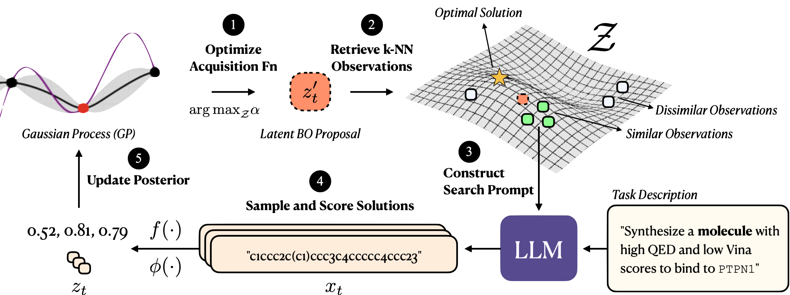

# Bayesian Optimization via Prompting (BOPRO)

Official implementation of the ICLR 2025 paper: **"Searching for Optimal Solutions with LLMs via Bayesian
Optimization"** (or BOPRO; **B**ayesian **O**ptimization via **Pro**mpting).

> Paper: [https://openreview.net/pdf?id=aVfDrl7xDV](https://openreview.net/pdf?id=aVfDrl7xDV)

## Setup

- Install miniconda (https://docs.anaconda.com/miniconda/)
- Create and activate conda environment
  ```shell
  conda create -n bopro \
    python=3.11 pandas numpy matplotlib scikit-learn jupyterlab --y \
    && conda activate bopro
  ```
- Install PyTorch
  ```shell
  pip3 install torch
  ```
- Install packages in `requirements.txt`
  ```shell
  pip3 install -r requirements.txt
  ```
- Install SimCSE from source
  ```shell
  git clone https://github.com/princeton-nlp/SimCSE.git && cd SimCSE

  vi setup.py # remove version numbers from packages (L21 and L24)
  vi simcse/tool.py # add argument `silent=False` in L52
  vi simcse/tool.py # add `disable=silent` to the tqdm call in L65
  
  python setup.py install && cd .. && rm -rf SimCSE
  ```
- Install Laplace botorch
  ```shell
  pip3 install laplace-torch \
    && pip3 install git+https://git@github.com/wiseodd/asdl@asdfghjkl \
    && pip3 install laplace-bayesopt
  
  # pip3 install git+https://github.com/aleximmer/laplace.git@0.2 \
  # && pip3 install laplace-bayesopt \
  # && python -m pip3 install setuptools==69.5.1 # needed for laplace-bayesopt
  ```

## Experiments

### Semantle

```shell
# LogEI
python src/semantle_bo.py --gen_model="mistral-large-2407" --repr_model="gte-qwen-2-1.5b-instruct" --repr_prompt="%s" --low_dim_strategy="off" --acquisition_fn="logEI" --out_dir="outputs-semantle-20241020-extended-noscores-matern" --run_id="logei" --task_fpath="data/semantle/train" --n_evaluations=1000 --n_seeds=5 --llm_temperature=1 --opt_batch_size=1 --vec2text_batch_size=10 --vec2text_n_parallel=2 --kernel_mean_prior_mean=0.4 --kernel_mean_prior_std=0.01 --kernel_lengthscale_prior_concentration=4 --kernel_lengthscale_prior_rate=2 --kernel_outputscale_prior_concentration=4 --kernel_outputscale_prior_rate=2 --gp_kernel="matern" --gp_noise_var=0.001 --no-kernel_per_dim_lengthscale --use_method_defaults --no-arc_use_scores
python src/semantle_bo.py --gen_model="mistral-large-2407" --repr_model="gte-qwen-2-1.5b-instruct" --repr_prompt="%s" --low_dim_strategy="off" --acquisition_fn="logEI" --out_dir="outputs-semantle-20241020-extended-noscores-matern" --run_id="logei" --task_fpath="data/semantle/test" --n_evaluations=1000 --n_seeds=5 --llm_temperature=1 --opt_batch_size=1 --vec2text_batch_size=10 --vec2text_n_parallel=2 --kernel_mean_prior_mean=0.4 --kernel_mean_prior_std=0.01 --kernel_lengthscale_prior_concentration=4 --kernel_lengthscale_prior_rate=2 --kernel_outputscale_prior_concentration=4 --kernel_outputscale_prior_rate=2 --gp_kernel="matern" --gp_noise_var=0.001 --no-kernel_per_dim_lengthscale --use_method_defaults --no-arc_use_scores

# UCB
python src/semantle_bo.py --gen_model="mistral-large-2407" --repr_model="gte-qwen-2-1.5b-instruct" --repr_prompt="%s" --low_dim_strategy="off" --acquisition_fn="UCB" --out_dir="outputs-semantle-20241020-extended-noscores-matern" --run_id="ucb" --task_fpath="data/semantle/train" --n_evaluations=1000 --n_seeds=5 --llm_temperature=1 --opt_batch_size=1 --vec2text_batch_size=10 --vec2text_n_parallel=2 --kernel_mean_prior_mean=0.4 --kernel_mean_prior_std=0.01 --kernel_lengthscale_prior_concentration=4 --kernel_lengthscale_prior_rate=2 --kernel_outputscale_prior_concentration=4 --kernel_outputscale_prior_rate=2 --gp_kernel="matern" --gp_noise_var=0.001 --no-kernel_per_dim_lengthscale --use_method_defaults --no-arc_use_scores
python src/semantle_bo.py --gen_model="mistral-large-2407" --repr_model="gte-qwen-2-1.5b-instruct" --repr_prompt="%s" --low_dim_strategy="off" --acquisition_fn="UCB" --out_dir="outputs-semantle-20241020-extended-noscores-matern" --run_id="ucb" --task_fpath="data/semantle/test" --n_evaluations=1000 --n_seeds=5 --llm_temperature=1 --opt_batch_size=1 --vec2text_batch_size=10 --vec2text_n_parallel=2 --kernel_mean_prior_mean=0.4 --kernel_mean_prior_std=0.01 --kernel_lengthscale_prior_concentration=4 --kernel_lengthscale_prior_rate=2 --kernel_outputscale_prior_concentration=4 --kernel_outputscale_prior_rate=2 --gp_kernel="matern" --gp_noise_var=0.001 --no-kernel_per_dim_lengthscale --use_method_defaults --no-arc_use_scores

# Thompson sampling
python src/semantle_bo.py --gen_model="mistral-large-2407" --repr_model="gte-qwen-2-1.5b-instruct" --repr_prompt="%s" --low_dim_strategy="off" --acquisition_fn="thompson_sampling" --out_dir="outputs-semantle-20241020-extended-noscores-matern" --run_id="thompson_sampling" --task_fpath="data/semantle/train" --n_evaluations=1000 --n_seeds=5 --llm_temperature=1 --opt_batch_size=1 --vec2text_batch_size=10 --vec2text_n_parallel=2 --kernel_mean_prior_mean=0.4 --kernel_mean_prior_std=0.01 --kernel_lengthscale_prior_concentration=4 --kernel_lengthscale_prior_rate=2 --kernel_outputscale_prior_concentration=4 --kernel_outputscale_prior_rate=2 --gp_kernel="matern" --gp_noise_var=0.001 --no-kernel_per_dim_lengthscale --use_method_defaults --no-arc_use_scores
python src/semantle_bo.py --gen_model="mistral-large-2407" --repr_model="gte-qwen-2-1.5b-instruct" --repr_prompt="%s" --low_dim_strategy="off" --acquisition_fn="thompson_sampling" --out_dir="outputs-semantle-20241020-extended-noscores-matern" --run_id="thompson_sampling" --task_fpath="data/semantle/test" --n_evaluations=1000 --n_seeds=5 --llm_temperature=1 --opt_batch_size=1 --vec2text_batch_size=10 --vec2text_n_parallel=2 --kernel_mean_prior_mean=0.4 --kernel_mean_prior_std=0.01 --kernel_lengthscale_prior_concentration=4 --kernel_lengthscale_prior_rate=2 --kernel_outputscale_prior_concentration=4 --kernel_outputscale_prior_rate=2 --gp_kernel="matern" --gp_noise_var=0.001 --no-kernel_per_dim_lengthscale --use_method_defaults --no-arc_use_scores

# Repeated sampling
python src/semantle_bo.py --gen_model="mistral-large-2407" --repr_model="gte-qwen-2-1.5b-instruct" --repr_prompt="%s" --low_dim_strategy="off" --acquisition_fn="none" --out_dir="outputs-semantle-20241020-extended-noscores-matern" --run_id="none" --task_fpath="data/semantle/train" --n_evaluations=1000 --n_seeds=5 --llm_temperature=1 --opt_batch_size=1 --vec2text_batch_size=10 --vec2text_n_parallel=2 --kernel_mean_prior_mean=0.4 --kernel_mean_prior_std=0.01 --kernel_lengthscale_prior_concentration=4 --kernel_lengthscale_prior_rate=2 --kernel_outputscale_prior_concentration=4 --kernel_outputscale_prior_rate=2 --gp_kernel="matern" --gp_noise_var=0.001 --no-kernel_per_dim_lengthscale --use_method_defaults --no-arc_use_scores
python src/semantle_bo.py --gen_model="mistral-large-2407" --repr_model="gte-qwen-2-1.5b-instruct" --repr_prompt="%s" --low_dim_strategy="off" --acquisition_fn="none" --out_dir="outputs-semantle-20241020-extended-noscores-matern" --run_id="none" --task_fpath="data/semantle/test" --n_evaluations=1000 --n_seeds=5 --llm_temperature=1 --opt_batch_size=1 --vec2text_batch_size=10 --vec2text_n_parallel=2 --kernel_mean_prior_mean=0.4 --kernel_mean_prior_std=0.01 --kernel_lengthscale_prior_concentration=4 --kernel_lengthscale_prior_rate=2 --kernel_outputscale_prior_concentration=4 --kernel_outputscale_prior_rate=2 --gp_kernel="matern" --gp_noise_var=0.001 --no-kernel_per_dim_lengthscale --use_method_defaults --no-arc_use_scores

# Random
python src/semantle_bo.py --gen_model="mistral-large-2407" --repr_model="gte-qwen-2-1.5b-instruct" --repr_prompt="%s" --low_dim_strategy="off" --acquisition_fn="random" --out_dir="outputs-semantle-20241020-extended-noscores-matern" --run_id="random" --task_fpath="data/semantle/train" --n_evaluations=1000 --n_seeds=5 --llm_temperature=1 --opt_batch_size=1 --vec2text_batch_size=10 --vec2text_n_parallel=2 --kernel_mean_prior_mean=0.4 --kernel_mean_prior_std=0.01 --kernel_lengthscale_prior_concentration=4 --kernel_lengthscale_prior_rate=2 --kernel_outputscale_prior_concentration=4 --kernel_outputscale_prior_rate=2 --gp_kernel="matern" --gp_noise_var=0.001 --no-kernel_per_dim_lengthscale --use_method_defaults --no-arc_use_scores
python src/semantle_bo.py --gen_model="mistral-large-2407" --repr_model="gte-qwen-2-1.5b-instruct" --repr_prompt="%s" --low_dim_strategy="off" --acquisition_fn="random" --out_dir="outputs-semantle-20241020-extended-noscores-matern" --run_id="random" --task_fpath="data/semantle/test" --n_evaluations=1000 --n_seeds=5 --llm_temperature=1 --opt_batch_size=1 --vec2text_batch_size=10 --vec2text_n_parallel=2 --kernel_mean_prior_mean=0.4 --kernel_mean_prior_std=0.01 --kernel_lengthscale_prior_concentration=4 --kernel_lengthscale_prior_rate=2 --kernel_outputscale_prior_concentration=4 --kernel_outputscale_prior_rate=2 --gp_kernel="matern" --gp_noise_var=0.001 --no-kernel_per_dim_lengthscale --use_method_defaults --no-arc_use_scores
```

### Molecule Optimization

```shell
# LogEI
python src/molopt_bo.py --gen_model="mistral-large-2407" --repr_model="molformer" --repr_prompt="target_based" --low_dim_strategy="off" --acquisition_fn="logEI" --out_dir="outputs-molopt-20241117-mistral" --run_id="logei" --task_fpath="data/molopt/data.json" --n_evaluations=500 --n_seeds=3 --llm_temperature=1 --opt_batch_size=1 --vec2text_batch_size=5 --vec2text_n_parallel=1 --kernel_mean_prior_mean=0.4 --kernel_mean_prior_std=0.01 --kernel_lengthscale_prior_concentration=4 --kernel_lengthscale_prior_rate=2 --kernel_outputscale_prior_concentration=4 --kernel_outputscale_prior_rate=2 --gp_kernel="matern" --gp_noise_var=0.001 --no-kernel_per_dim_lengthscale --use_method_defaults --no-arc_use_scores --no-visualize_posterior

# UCB
python src/molopt_bo.py --gen_model="mistral-large-2407" --repr_model="molformer" --repr_prompt="target_based" --low_dim_strategy="off" --acquisition_fn="UCB" --out_dir="outputs-molopt-20241117-mistral" --run_id="ucb" --task_fpath="data/molopt/data.json" --n_evaluations=500 --n_seeds=3 --llm_temperature=1 --opt_batch_size=1 --vec2text_batch_size=5 --vec2text_n_parallel=1 --kernel_mean_prior_mean=0.4 --kernel_mean_prior_std=0.01 --kernel_lengthscale_prior_concentration=4 --kernel_lengthscale_prior_rate=2 --kernel_outputscale_prior_concentration=4 --kernel_outputscale_prior_rate=2 --gp_kernel="matern" --gp_noise_var=0.001 --no-kernel_per_dim_lengthscale --use_method_defaults --no-arc_use_scores --no-visualize_posterior

# Thompson sampling
python src/molopt_bo.py --gen_model="mistral-large-2407" --repr_model="molformer" --repr_prompt="target_based" --low_dim_strategy="off" --acquisition_fn="thompson_sampling" --out_dir="outputs-molopt-20241117-mistral" --run_id="thompson_sampling" --task_fpath="data/molopt/data.json" --n_evaluations=500 --n_seeds=3 --llm_temperature=1 --opt_batch_size=1 --vec2text_batch_size=5 --vec2text_n_parallel=1 --kernel_mean_prior_mean=0.4 --kernel_mean_prior_std=0.01 --kernel_lengthscale_prior_concentration=4 --kernel_lengthscale_prior_rate=2 --kernel_outputscale_prior_concentration=4 --kernel_outputscale_prior_rate=2 --gp_kernel="matern" --gp_noise_var=0.001 --no-kernel_per_dim_lengthscale --use_method_defaults --no-arc_use_scores --no-visualize_posterior

# Repeated sampling
python src/molopt_bo.py --gen_model="mistral-large-2407" --repr_model="molformer" --repr_prompt="target_based" --low_dim_strategy="off" --acquisition_fn="none" --out_dir="outputs-molopt-20241117-mistral" --run_id="none" --task_fpath="data/molopt/data.json" --n_evaluations=500 --n_seeds=3 --llm_temperature=1 --opt_batch_size=1 --vec2text_batch_size=5 --vec2text_n_parallel=1 --kernel_mean_prior_mean=0.4 --kernel_mean_prior_std=0.01 --kernel_lengthscale_prior_concentration=4 --kernel_lengthscale_prior_rate=2 --kernel_outputscale_prior_concentration=4 --kernel_outputscale_prior_rate=2 --gp_kernel="matern" --gp_noise_var=0.001 --no-kernel_per_dim_lengthscale --use_method_defaults --no-arc_use_scores --no-visualize_posterior

# Random
python src/molopt_bo.py --gen_model="mistral-large-2407" --repr_model="molformer" --repr_prompt="target_based" --low_dim_strategy="off" --acquisition_fn="random" --out_dir="outputs-molopt-20241117-mistral" --run_id="random" --task_fpath="data/molopt/data.json" --n_evaluations=500 --n_seeds=3 --llm_temperature=1 --opt_batch_size=1 --vec2text_batch_size=5 --vec2text_n_parallel=1 --kernel_mean_prior_mean=0.4 --kernel_mean_prior_std=0.01 --kernel_lengthscale_prior_concentration=4 --kernel_lengthscale_prior_rate=2 --kernel_outputscale_prior_concentration=4 --kernel_outputscale_prior_rate=2 --gp_kernel="matern" --gp_noise_var=0.001 --no-kernel_per_dim_lengthscale --use_method_defaults --no-arc_use_scores --no-visualize_posterior

# OPRO
python src/molopt_bo.py --gen_model="mistral-large-2407" --repr_model="molformer" --repr_prompt="target_based" --low_dim_strategy="off" --acquisition_fn="OPRO" --out_dir="outputs-molopt-20241117-mistral" --run_id="opro" --task_fpath="data/molopt/data.json" --n_evaluations=500 --n_seeds=3 --llm_temperature=1 --opt_batch_size=1 --vec2text_batch_size=5 --vec2text_n_parallel=1 --kernel_mean_prior_mean=0.4 --kernel_mean_prior_std=0.01 --kernel_lengthscale_prior_concentration=4 --kernel_lengthscale_prior_rate=2 --kernel_outputscale_prior_concentration=4 --kernel_outputscale_prior_rate=2 --gp_kernel="matern" --gp_noise_var=0.001 --no-kernel_per_dim_lengthscale --use_method_defaults --no-arc_use_scores --no-visualize_posterior
```

### 1D-ARC-Hard

```shell
# UCB
CUDA_VISIBLE_DEVICES=3 python src/arc_bo.py --task="arc" --task_fpath="data/arc-1d-full" --bbox_model="codegen" --gen_model="mistral-large-2407" --repr_model="gte-qwen-2-1.5b-instruct" --candidates_fname="outputs-arc1d-full-mistral/cands100" --out_dir="outputs-arc1d-hard-mistral-20240922" --n_warmstart=100 --no-visualize_posterior --llm_tokens=2048 --llm_temperature=1 --n_seeds=1 --vec2text_unique_retries=0 --vec2text_fix_retries=1 --vec2text_revise_retries=0 --repr_codegen_strategy="docstring" --no-repr_codegen_instruct --no-arc_use_code --arc_use_docstring --use_method_defaults --opt_batch_size=1 --kernel_lengthscale_prior_concentration=35 --kernel_lengthscale_prior_rate=30 --kernel_mean_prior_mean=0.5 --kernel_mean_prior_std=0.01 --n_evaluations=200 --vec2text_batch_size=10 --vec2text_n_parallel=5 --vec2text_demos=3 --no-surr_skip_invalid_candidates --set_invalid_to_zero --run_id="ucb" --acquisition_fn="UCB" --target=""
# TS
CUDA_VISIBLE_DEVICES=3 python src/arc_bo.py --task="arc" --task_fpath="data/arc-1d-full" --bbox_model="codegen" --gen_model="mistral-large-2407" --repr_model="gte-qwen-2-1.5b-instruct" --candidates_fname="outputs-arc1d-full-mistral/cands100" --out_dir="outputs-arc1d-hard-mistral-20240922" --n_warmstart=100 --no-visualize_posterior --llm_tokens=2048 --llm_temperature=1 --n_seeds=1 --vec2text_unique_retries=0 --vec2text_fix_retries=1 --vec2text_revise_retries=0 --repr_codegen_strategy="docstring" --no-repr_codegen_instruct --no-arc_use_code --arc_use_docstring --use_method_defaults --opt_batch_size=1 --kernel_lengthscale_prior_concentration=35 --kernel_lengthscale_prior_rate=30 --kernel_mean_prior_mean=0.5 --kernel_mean_prior_std=0.01 --n_evaluations=200 --vec2text_batch_size=10 --vec2text_n_parallel=5 --vec2text_demos=3 --no-surr_skip_invalid_candidates --set_invalid_to_zero --run_id="thompson_sampling" --acquisition_fn="thompson_sampling" --target=""
# OPRO
CUDA_VISIBLE_DEVICES=3 python src/arc_bo.py --task="arc" --task_fpath="data/arc-1d-full" --bbox_model="codegen" --gen_model="mistral-large-2407" --repr_model="gte-qwen-2-1.5b-instruct" --candidates_fname="outputs-arc1d-full-mistral/cands100" --out_dir="outputs-arc1d-hard-mistral-20240922" --n_warmstart=100 --no-visualize_posterior --llm_tokens=2048 --llm_temperature=1 --n_seeds=1 --vec2text_unique_retries=0 --vec2text_fix_retries=1 --vec2text_revise_retries=0 --repr_codegen_strategy="docstring" --no-repr_codegen_instruct --no-arc_use_code --arc_use_docstring --use_method_defaults --opt_batch_size=1 --kernel_lengthscale_prior_concentration=35 --kernel_lengthscale_prior_rate=30 --kernel_mean_prior_mean=0.5 --kernel_mean_prior_std=0.01 --n_evaluations=200 --vec2text_batch_size=10 --vec2text_n_parallel=5 --vec2text_demos=3 --no-surr_skip_invalid_candidates --set_invalid_to_zero --run_id="opro" --acquisition_fn="OPRO" --target=""
# None
CUDA_VISIBLE_DEVICES=3 python src/arc_bo.py --task="arc" --task_fpath="data/arc-1d-full" --bbox_model="codegen" --gen_model="mistral-large-2407" --repr_model="gte-qwen-2-1.5b-instruct" --candidates_fname="outputs-arc1d-full-mistral/cands100" --out_dir="outputs-arc1d-hard-mistral-20240922" --n_warmstart=100 --no-visualize_posterior --llm_tokens=2048 --llm_temperature=1 --n_seeds=1 --vec2text_unique_retries=0 --vec2text_fix_retries=1 --vec2text_revise_retries=0 --repr_codegen_strategy="docstring" --no-repr_codegen_instruct --no-arc_use_code --arc_use_docstring --use_method_defaults --opt_batch_size=1 --kernel_lengthscale_prior_concentration=35 --kernel_lengthscale_prior_rate=30 --kernel_mean_prior_mean=0.5 --kernel_mean_prior_std=0.01 --n_evaluations=200 --vec2text_batch_size=10 --vec2text_n_parallel=5 --vec2text_demos=3 --no-surr_skip_invalid_candidates --set_invalid_to_zero --run_id="none" --acquisition_fn="none" --target=""

# BLMX:

# UCB
CUDA_VISIBLE_DEVICES=6 python src/arc_bo.py --task="arc" --task_fpath="data/arc-1d-full" --bbox_model="codegen" --gen_model="mistral-large-2407" --repr_model="gte-qwen-2-1.5b-instruct" --candidates_fname="outputs-arc1d-full-mistral/cands100" --out_dir="outputs-arc1d-hard-mistral-20240922" --n_warmstart=100 --no-visualize_posterior --llm_tokens=2048 --llm_temperature=1 --n_seeds=1 --vec2text_unique_retries=0 --vec2text_fix_retries=1 --vec2text_revise_retries=0 --repr_codegen_strategy="docstring" --no-repr_codegen_instruct --no-arc_use_code --arc_use_docstring --use_method_defaults --opt_batch_size=1 --kernel_lengthscale_prior_concentration=35 --kernel_lengthscale_prior_rate=30 --kernel_mean_prior_mean=0.5 --kernel_mean_prior_std=0.01 --n_evaluations=200 --vec2text_batch_size=10 --vec2text_n_parallel=5 --vec2text_demos=3 --no-surr_skip_invalid_candidates --set_invalid_to_zero --run_id="lmx-ucb" --acquisition_fn="UCB" --vec2text_lmx --target=""
# TS
CUDA_VISIBLE_DEVICES=3 python src/arc_bo.py --task="arc" --task_fpath="data/arc-1d-full" --bbox_model="codegen" --gen_model="mistral-large-2407" --repr_model="gte-qwen-2-1.5b-instruct" --candidates_fname="outputs-arc1d-full-mistral/cands100" --out_dir="outputs-arc1d-hard-mistral-20240922" --n_warmstart=100 --no-visualize_posterior --llm_tokens=2048 --llm_temperature=1 --n_seeds=1 --vec2text_unique_retries=0 --vec2text_fix_retries=1 --vec2text_revise_retries=0 --repr_codegen_strategy="docstring" --no-repr_codegen_instruct --no-arc_use_code --arc_use_docstring --use_method_defaults --opt_batch_size=1 --kernel_lengthscale_prior_concentration=35 --kernel_lengthscale_prior_rate=30 --kernel_mean_prior_mean=0.5 --kernel_mean_prior_std=0.01 --n_evaluations=200 --vec2text_batch_size=10 --vec2text_n_parallel=5 --vec2text_demos=3 --no-surr_skip_invalid_candidates --set_invalid_to_zero --run_id="lmx-thompson_sampling" --acquisition_fn="thompson_sampling" --vec2text_lmx --target=""
# LMX
CUDA_VISIBLE_DEVICES=3 python src/arc_bo.py --task="arc" --task_fpath="data/arc-1d-full" --bbox_model="codegen" --gen_model="mistral-large-2407" --repr_model="gte-qwen-2-1.5b-instruct" --candidates_fname="outputs-arc1d-full-mistral/cands100" --out_dir="outputs-arc1d-hard-mistral-20240922" --n_warmstart=100 --no-visualize_posterior --llm_tokens=2048 --llm_temperature=1 --n_seeds=1 --vec2text_unique_retries=0 --vec2text_fix_retries=1 --vec2text_revise_retries=0 --repr_codegen_strategy="docstring" --no-repr_codegen_instruct --no-arc_use_code --arc_use_docstring --use_method_defaults --opt_batch_size=1 --kernel_lengthscale_prior_concentration=35 --kernel_lengthscale_prior_rate=30 --kernel_mean_prior_mean=0.5 --kernel_mean_prior_std=0.01 --n_evaluations=200 --vec2text_batch_size=10 --vec2text_n_parallel=5 --vec2text_demos=3 --no-surr_skip_invalid_candidates --set_invalid_to_zero --run_id="lmx" --acquisition_fn="OPRO" --vec2text_lmx --target=""
```

---

## License

This project is licensed under the Apache-2.0 License.

---

## ✍️ Get in touch!

Please reach out to us on email or open a GitHub issue in case of any issues running the code: dagarwal@cs.umass.edu **(Dhruv Agarwal)**, mghuhan@amazon.com **(Manoj Ghuhan Arivazhagan)**.

---

## 📄 Citation
If you find our work useful, please cite our paper:

```
@inproceedings{
  agarwal2025searching,
  title={Searching for Optimal Solutions with {LLM}s via Bayesian Optimization},
  author={Dhruv Agarwal and Manoj Ghuhan Arivazhagan and Rajarshi Das and Sandesh Swamy and Sopan Khosla and Rashmi Gangadharaiah},
  booktitle={The Thirteenth International Conference on Learning Representations},
  year={2025},
  url={https://openreview.net/forum?id=aVfDrl7xDV}
}
```